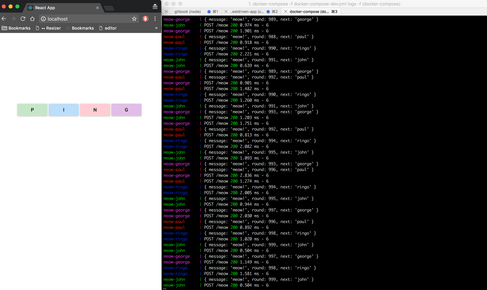

# Microservice Ping Pong



## Getting Started

1. Fork/Clone this repo

1. Download [Docker](https://docs.docker.com/docker-for-mac/install/) (if necessary)

1. Make sure you are using a Docker version >= 17:

    ```sh
    $ docker -v
    Docker version 17.09.0-ce, build afdb6d4
    ```

1. Set the Environment variables:

    ```sh
    $ export REACT_APP_BASE_URL=http://DOCKER_MACHINE_IP
    ```

1. Fire up the Containers

    ```sh
    $ docker-compose -f docker-compose-dev.yml up -d --build
    ```
